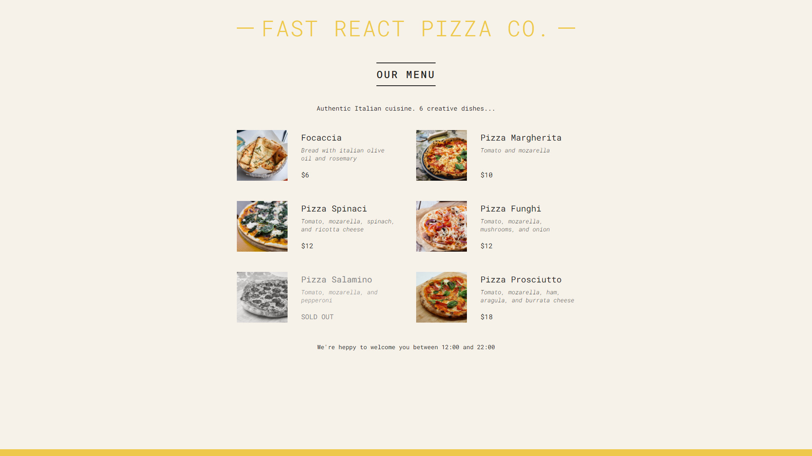

# Pizza menu

## Description

This is simple static website for pizza menu. It is created with React.

## Installation

To install this project you need to have Node.js installed on your computer. Then you can clone this repository and run `npm install` in the project directory.

## Usage

To run this project you need to run `npm start` in the project directory. Then you can open [http://localhost:3000](http://localhost:3000) to view it in the browser.
